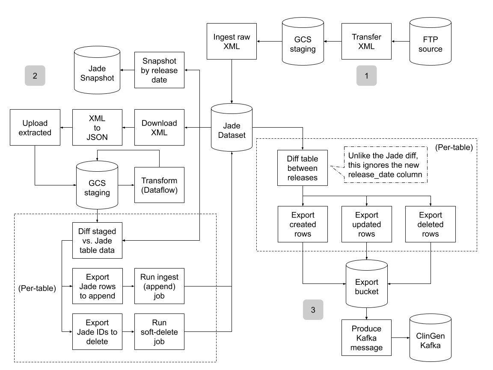

# ClinVar Ingest
Batch ETL pipeline to mirror ClinVar releases first into the Terra Data Repository (TDR),
then into ClinGen's Kafka processing pipeline.

## Schema Design
The schema used for this dataset was (largely) designed by the ClinGen team. JSON
definitions of the resulting tables can be found under [`schema/`](./schema). Some
pieces of the design are worth calling out here:
1. Every table includes a `release_date` column
2. Most tables contain a `content` column to store unmodeled data
3. Some tables are used to track processing provenance, instead of primary data

### Using Release Date
Every table in the ClinVar dataset includes a `release_date` column, used as (part of)
the primary key. This means that the base TDR dataset shows the latest data for _every_
processed release, not just the latest processed release. We do this to enable:
* Parallel processing & ingest of raw archives
* Targeted reprocessing of archives

The downsides of this scheme are:
* A significant amount of data is duplicated from release to release
* Creating a snapshot of a single release is more complicated

### Handling Unmodeled Data
Most tables in the ClinVar dataset include a `content` column. We use these columns to
store unmodeled data as string-encoded JSON. This allows us to fully ETL the pieces of
the data we're most interested in, without throwing any information away. It also insulates
us against future additions in the NCBI source schema.

### Tracking Provenance
The `xml_archive` and `processing_history` tables both track provenance-related
information in the dataset.
* `xml_archive` tracks references to raw XML payloads per release
* `processing_history` tracks the pipeline version and run date of processing per release

The ingest pipeline uses information in these tables to short-circuit when appropriate.
* If a release date is already present in `xml_archive`, the corresponding raw XML is
  not re-ingested
* If a release date / pipeline version pair is already present in `processing_history`, the
  corresponding raw XML is not re-processed using that pipeline version

## Pipeline Architecture
The ingest pipeline is orchestration through Argo, with most data processing logic
delegated to Dataflow and BigQuery. The high level flow looks like:

As shown, end-to-end ingest is broken into 3 distinct sub-workflows, to mitigate
failures and reduce the work needed to run a partial reprocessing. The 3 phases are:
1. Raw data ingest
2. Data processing and re-ingest
3. Export to ClinGen

### Raw Ingest
Stage 1 of ingest prioritizes stashing the raw XML payloads from NCBI in the TDR. We package
this as a focused end-to-end workflow because NCBI weekly releases are only available during
the same month as their release. If we tightly coupled ingesting these raw payloads with their
downstream processing, and that processing suddenly broke, it could take us "too long" to fix
the logic and the weekly release could disappear. Separating the XML ingest into its own step
minimizes the chances of this scenario.

### Data Processing
Stage 2 of ingest runs the bulk of our business logic. For a target release date, it:
1. Downloads a raw XML release from the TDR, to a local volume in k8s
2. Converts the XML to JSON-list, and uploads it back to GCS
3. Runs a Dataflow pipeline to process the JSON into our target schema
4. Per-table:
   1. Uses BigQuery to diff staged data against the current TDR state
   2. Uses the TDR APIs to ingest/soft-delete data so that the TDR state
      matches staged data
5. Cuts a TDR snapshot for the release

### Export to ClinGen
Stage 3 of ingest exports processed data to ClinGen. For a pair of release dates, it:
1. Per-table:
   1. Compares data across the two releases to get a diff of created/updated/deleted rows
   2. Exports the three "slices" of data from the diff into GCS
2. Produces a Kafka message to ClinGen, pointing at the exported data

